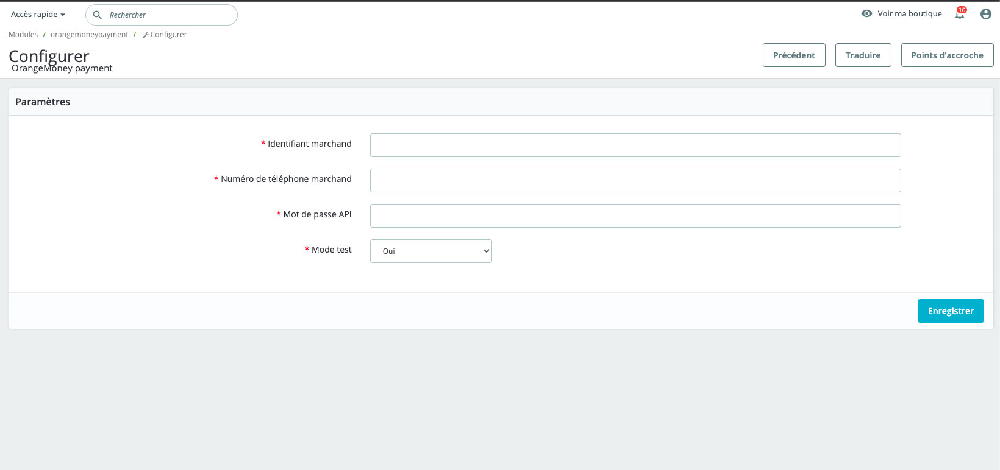
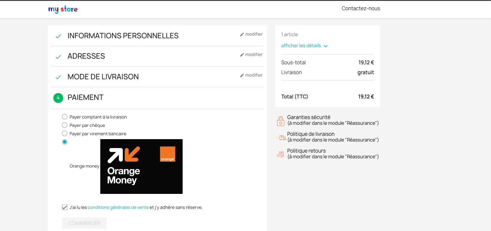
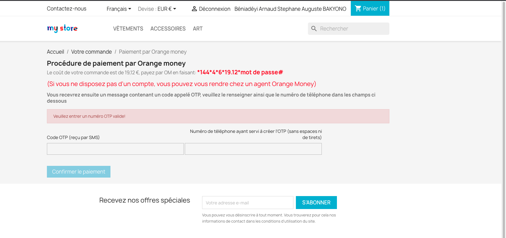

# Prestashop-orange-money-payment-module

This is a prestashop payment module for Orange money, this repo only works for Orange money Burkina Faso for now

Installing the module will create a table named **_DB_PREFIX_orange_money_module_order_transaction** with this schema to save data on payment, like transactionId

id INT PRIMARY KEY AUTO_INCREMENT,
id_transaction VARCHAR(255) NOT NULL,
payment_method VARCHAR(255) NOT NULL,
id_order INT NOT NULL

- Module configuration page 

- Choose payment page

- Confirm payment page

